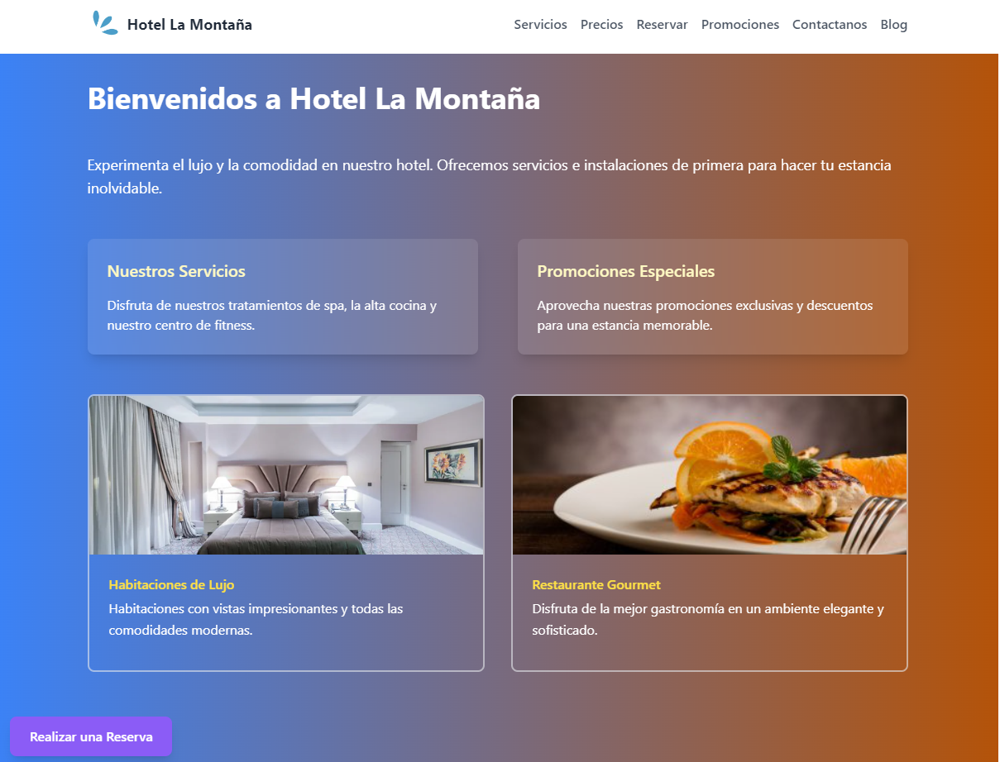

# Hotel La Montaña - Página Web SPA

## Descripción

Este proyecto consiste en una Single Page Application (SPA) construida con React, Vite, React Router y un servidor con Node.js y Express. La página web está diseñada para promocionar y ofrecer información sobre el Hotel La Montaña, con funcionalidades avanzadas para mejorar la experiencia del usuario.

## Características Principales

1. **Diseño y Responsividad:**
   - Utilización de flexbox y grid para un diseño atractivo y avanzado.
   - Totalmente responsive para adaptarse a diferentes dispositivos y resoluciones.
   - Implementación de animaciones y transiciones suaves para mejorar la experiencia del usuario.

2. **Contenido:**
   - Información detallada sobre servicios, horarios, precios y promociones especiales.
   - Sección de blog con artículos sobre turismo, consejos de viaje y guías turísticas relacionadas al estado de Venezuela.
   - Testimonios de clientes destacando los resultados obtenidos con los servicios del Hotel.

3. **Paleta de Colores y Tipografías:**
   - Paleta de colores seleccionada para transmitir una sensación de tranquilidad y bienestar.
   - Utilización de tipografías elegantes y legibles que complementan la estética del Hotel.

4. **React Router y Transiciones:**
   - Uso de React Router para una navegación fluida y amigable.
   - Implementación de transiciones animadas utilizando Framer Motion para efectos visuales sofisticados.

5. **Frameworks de CSS o Sass:**
   - Utilización de Tailwind CSS para agilizar el desarrollo y mejorar el aspecto visual.
   - Organización eficiente del código Sass para fácil mantenibilidad.

6. **Programación Reactiva con Hooks, Componentes y Props:**
   - Uso de hooks como useState, useEffect y useContext para administrar el estado y la lógica.
   - División del código en componentes reutilizables, aprovechando props y context para pasar datos.

7. **Formulario y Almacenamiento de Datos:**
   - Implementación de un formulario avanzado para realizar reservas.
   - Validación robusta en el formulario con mensajes de error claros.
   - Envío de correo electrónico al usuario con todos los detalles de la reserva y contactos para pagos posteriores.

8. **Integración de APIs Externas:**
   - Integración de una API externa para obtener el pronóstico del clima local.
   - Uso de Axios para realizar solicitudes HTTP y mostrar datos relevantes en la página web.

## Instrucciones de Instalación y Uso

1. **Clonar el Repositorio:**

git clone https://github.com/tu-usuario/hotel-la-montana.git
cd frontend-3.1

2. **Instalar Dependencias:**

npm install

3. **Ejecutar la Aplicación:**

npm run dev 

4. **Acceder a la Aplicación:**
Abre tu navegador y visita [http://localhost:5173](http://localhost:5173)

## Contribución

Si deseas contribuir al proyecto, sigue estos pasos:

1. Crea un nuevo *branch*: `git checkout -b feature/nueva-funcionalidad`
2. Realiza tus cambios y haz *commit*: `git commit -m 'Añadir nueva funcionalidad'`
3. Sube tus cambios al repositorio: `git push origin feature/nueva-funcionalidad`
4. Crea una nueva *Pull Request*

## Licencia

Este proyecto está bajo la Licencia MIT - ver el archivo [LICENSE.md](LICENSE.md) para más detalles.

## Creadores

Este proyecto fue desarrollado con amor y dedicación por el equipo de desarrollo. Agradecemos a cada miembro por contribuir y hacer posible esta experiencia única.

- [Arraiz Angel](https://github.com/arrayz-code)
- [Mariely Viloria](https://github.com/ely2547)

Si tienes alguna pregunta o comentario, no dudes en contactar a alguno de nuestros creadores. Estamos aquí para hacer tu experiencia en Hotel La Montaña aún más especial.
